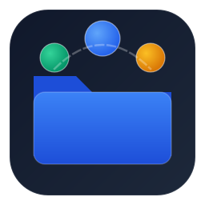

<p align="center">
  
</p>

<h1 align="center">File Juggler</h1>

<p align="center">
  <strong>The Intelligent, Safe & 100% Offline Desktop File Organizer for Windows</strong>
</p>

<p align="center">
  <a href="#features"></a>
  <a href="#prerequisites"></a>
  <a href="#architecture"></a>
  <a href="SECURITY_AND_PRIVACY.md"></a>
  <a href="LICENSE.txt"></a>
</p>

<p align="center">
  Tired of cluttered <strong>Downloads</strong>, chaotic <strong>Desktop</strong> screens, and unorganized media folders? <br/>
  <strong>File Juggler</strong> categorizes and relocates hundreds of files into clean, structured hierarchies in a single click — with zero data loss, interactive previews, and atomic rollbacks.
</p>

---

## 🌟 Key Features

### 🛡️ Zero-Data-Loss Architecture
- **Non-Destructive Execution**: Files are safely relocated using atomic operating system calls (`shutil.move` / `MoveFileExW`). Files are **never** deleted.
- **Smart Collision Resolution**: If a destination file with the same name already exists, File Juggler automatically adds numeric suffixes (e.g. `Invoice (1).pdf`) or applies your chosen duplicate policy.
- **Instant Rollback (Undo)**: Revert the last operation with a single click, instantly restoring moved files to their exact original paths.
- **Persistent Session Disband Engine**: Review past organize sessions from history and disband/restore files to their source folders at any time with automated pruning of empty destination folders.

### 🗂️ Flexible Classification Strategies
- **By File Type**: Automatically sorts files into curated categories:
  - *Images* (`.jpg`, `.png`, `.gif`, `.webp`, `.svg`, `.ico`)
  - *Documents* (`.pdf`, `.docx`, `.xlsx`, `.pptx`, `.txt`, `.csv`)
  - *Videos* (`.mp4`, `.mkv`, `.avi`, `.mov`)
  - *Audio* (`.mp3`, `.wav`, `.flac`, `.m4a`)
  - *Archives* (`.zip`, `.rar`, `.7z`, `.tar`, `.gz`)
  - *Code* (`.py`, `.js`, `.html`, `.css`, `.cpp`, `.java`, `.json`)
  - *Executables & Installers* (`.exe`, `.msi`)
- **By File Size**: Segment into customizable size tiers: Tiny (<1 MB), Small (1–10 MB), Medium (10–100 MB), Large (100 MB–1 GB), and Huge (>1 GB).
- **By Date Modified**: Group by Today, Yesterday, This Week, This Month, or Year.
- **Multi-Tier Combined Rules**: Create nested hierarchies like `Documents/Small` or `2026/Images`.

### 🔍 Interactive Inspection Grid
- **Live Search & Category Filtering**: Instantly search by filename or filter by specific extensions before organizing.
- **Granular Checkboxes**: Select or deselect individual files to maintain complete control over which files move.
- **Real-Time Telemetry**: Live metrics display total file count, scanned volume (MB/GB), and destination paths.

### 🔐 100% Offline & Client-Side Encrypted
- **Air-Gapped & Private**: **Zero cloud connections, zero telemetry, and zero remote data storage**. All file operations execute strictly on your local PC.
- **Encrypted at Rest**: User preferences and session logs are encrypted client-side using **Windows DPAPI (AES-256)** via hardware-accelerated user credentials.

### 🎨 Modern Windows Design
- Seamless high-contrast **Light Mode** and futuristic **Dark Mode** with 3D elevated cards.
- Native **High DPI Scaling** with crisp Segoe UI Variable typography.
- Fully integrated with the **Windows Taskbar** and **System Tray / Notification Area**.

---

## 📋 Prerequisites

Before running or building File Juggler locally, ensure your system meets the following requirements:

| Component | Requirement | Check Command |
|---|---|---|
| **Operating System** | Windows 10 (64-bit) or Windows 11 | `winver` |
| **Python** | Python 3.10 or higher (Python 3.12 recommended) | `python --version` |
| **Package Manager** | `pip` (included with Python) | `pip --version` |
| **Version Control** | Git | `git --version` |

> [!NOTE]
> When installing Python on Windows, make sure to check the box: **"Add python.exe to PATH"**.

---

## 🚀 Setup Guide: From Clone to Running (A to Z)

Follow these step-by-step instructions to get File Juggler running on your PC in under 2 minutes.

### Step 1: Clone the Repository
Open PowerShell or Command Prompt and run:
```powershell
git clone https://github.com/your-username/File_juggler_projec.git
cd File_juggler_projec
```

### Step 2: Create a Virtual Environment
Create an isolated Python virtual environment named `.venv`:
```powershell
python -m venv .venv
```

### Step 3: Activate the Virtual Environment
- **In PowerShell**:
  ```powershell
  .\.venv\Scripts\Activate.ps1
  ```
  *(If PowerShell gives an execution policy error, run `Set-ExecutionPolicy -Scope Process -ExecutionPolicy Bypass` once).*
- **In Command Prompt (cmd.exe)**:
  ```cmd
  .\.venv\Scripts\activate.bat
  ```

### Step 4: Install Dependencies
Install all required libraries (`PySide6`, `pytest`, etc.):
```powershell
pip install -r requirements.txt
```

### Step 5: Run File Juggler
Launch the desktop application:
```powershell
python app.py
```
*(Or simply double-click `run.bat` in Windows Explorer).*

### Step 6: Run Automated Tests
Verify that all 27 unit, integration, and security tests pass:
```powershell
pytest tests/ -v
```

---

## 📦 Single-File Executable Distribution (Share on Other PCs)

When sharing File Juggler with friends or other PCs, you **only need to share a single `.exe` file**. No Python, Git, or extra scripts are required on the target machine!

Choose whichever distribution style you prefer:

### Option A: Professional Windows Installer (`FileJuggler_Setup_v1.0.0.exe`) ⭐ *Recommended*
- **File Location**: `dist\installer\FileJuggler_Setup_v1.0.0.exe`
- **What it does**: 
  - Standard step-by-step installation wizard
  - Installs to `C:\Program Files\File Juggler`
  - Creates Desktop & Start Menu shortcuts with the application icon
  - Registers in Windows Control Panel (**Add/Remove Programs**) with a clean uninstaller
- **How to build**:
  ```cmd
  build_installer.bat
  ```
  *(Or in PowerShell: `.\build_installer.ps1`)*

### Option B: Standalone Portable Executable (`FileJuggler_Standalone.exe`)
- **File Location**: `dist\FileJuggler_Standalone.exe`
- **What it does**: 
  - Single self-contained `.exe`
  - Zero installation needed — double click to launch immediately from a USB drive or folder
- **How to build**:
  ```powershell
  pyinstaller --noconfirm FileJuggler_Onefile.spec
  ```

---

## 📁 Project Structure

```text
File_juggler_projec/
├── app.py                      # Application entrypoint & taskbar/tray binding
├── app.manifest                # Windows High DPI, theme, & UAC security manifest
├── FileJuggler.spec            # PyInstaller spec for directory bundle & installer
├── FileJuggler_Onefile.spec    # PyInstaller spec for single portable standalone .exe
├── build.bat                   # Batch build script for executable
├── build.ps1                   # PowerShell build script
├── build_installer.bat         # 1-click Windows installer compiler
├── build_installer.ps1         # PowerShell installer build automation
├── requirements.txt            # Python dependencies
├── pytest.ini                  # Test configuration
├── LICENSE.txt                 # MIT License & EULA
├── README.md                   # Project documentation
├── SECURITY_AND_PRIVACY.md     # Architecture & client-side encryption policy
├── CODE_SIGNING_GUIDE.md       # Windows SmartScreen & code signing reference
├── assets/                     # Vector icons and multi-resolution .ico/.png
│   ├── icon.ico                # Multi-resolution icon (16px to 256px)
│   └── icon.png                # High-res 256x256 application logo
├── src/
│   ├── core/
│   │   ├── scanner.py          # Asynchronous filesystem scanner
│   │   ├── classifier.py       # Classification engines (Type, Size, Date, Custom)
│   │   ├── organizer.py        # Safe atomic operations and collision handler
│   │   ├── duplicate_handler.py# Collision policies (Rename, Skip, Replace)
│   │   └── undo_manager.py     # Transactional rollback manager
│   ├── models/
│   │   ├── file_item.py        # File metadata dataclass
│   │   ├── organization_rule.py# Rule configurations
│   │   └── operation_result.py # Session telemetry & audit records
│   ├── services/
│   │   ├── settings_service.py # Encrypted configuration persistence
│   │   ├── history_service.py  # Encrypted session audit & disband engine
│   │   ├── logging_service.py  # Audit activity logging
│   │   └── encryption_service.py# Client-side DPAPI / AES-256 encryption
│   ├── ui/
│   │   ├── main_window.py      # Main window controller
│   │   ├── theme.py            # Light & Dark QSS themes
│   │   ├── views/
│   │   │   ├── setup_view.py   # Folder selection, modes, and controls
│   │   │   ├── preview_view.py # File inspection table with live filters
│   │   │   └── results_view.py # Execution summary, metrics, & rollback
│   │   └── dialogs/
│   │       ├── confirm_dialog.py   # Safety confirmation modal
│   │       ├── progress_dialog.py  # Progress tracking with cancellation
│   │       ├── settings_dialog.py  # Preferences modal
│   │       └── history_dialog.py   # Session history & disband manager
│   └── utils/
│       ├── file_utils.py       # Path validation & system guards
│       └── size_utils.py       # Human-readable formatting and bounds
├── tests/                      # Automated test suite (27 tests)
└── tools/                      # Portable Inno Setup compiler toolchain
```

---

## 🔒 Security & Privacy

File Juggler is built on a foundational philosophy of user privacy:
- **No Cloud Connections**: 100% offline and air-gapped.
- **Client-Side Encryption**: Local settings and session history are encrypted using **Windows DPAPI**.
- **Full Transparency**: See [SECURITY_AND_PRIVACY.md](SECURITY_AND_PRIVACY.md) for full architectural documentation.

---

## 📄 License

This project is licensed under the MIT License — see the [LICENSE.txt](LICENSE.txt) file for details.
